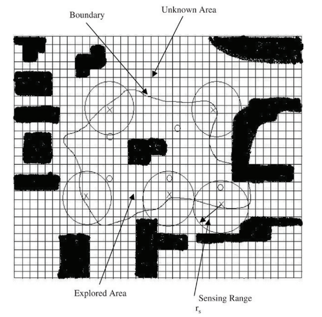
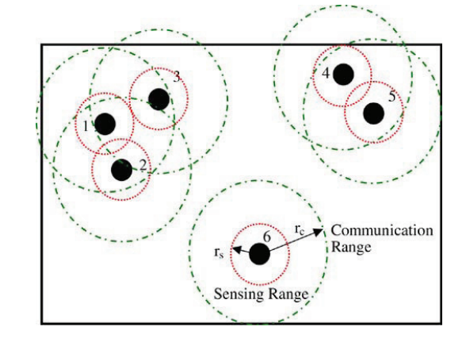

# DMCAE（Distributed Multi-Robot Coordination in Area Exploration）

## 分布式多机器人协同探索
这个项目是依据Sheng W等人于2006年发表的《Distributed multi-robot coordination in area exploration》，文中对二维空间中通信能力有限的机器人如何高效地协同探索的场景进行了深入的研究，提出了一种解决方案，由于篇幅有限，在这里只对总的流程做简单阐述
详细内容请参考论文：

## 场景设定
一个如图1所示的二维空间被分割成50x50个大小相等的方块（它们的大小和智能体正好相同）。在这个空间中随机散布着多个不规则的障碍物（黑色），和多个具有移动、定位、感知、通信能力的智能体（蓝色）。假定每一个智能体都知道自己的起始位置，智能体在空间中游走的同时完成对附近区域的探索，当两个智
能体彼此都处在对方的通信范围之内时，它们能够交换地图信息并对信息进行融合；当多个智能体构成一个连通的图时，就形成了连通子网，子网内的智能体之间通过直接或者间接的方式与对方交换地图信息并进行融合。

## 处理流程
在本部分将简要介绍作者在论文中给出的处理流程，并对其中的一些重要的步骤展开描述。
### 总体流程
如图所示，是处理智能体在进行区域探索时所遵循的流程图，虽然不同的算法在细节之处存在差别，但是主要的步骤一致。

首先，给定智能体一个收益函数，智能体根据这个函数寻找自己下一步移动的目标点，使得智能体在此处的收益最大化。然后向子网中的其他智能体广播自己选择的目标点，主持拍卖过程以完成目标点的指派。然后根据路径规划算法导航至目标点，导航过程中不断进行探测和通信，
当其他智能体进入它的通信范围时，二者构成连通关系，相互之间交换信息并将获取到的信息与原有的信息进行融合。重复上述过程，直至探测完整个区域。

### 收益函数
在论文中，作者选用的收益函数为：
$$g_i=\omega_1 I_i-\omega_2 D_i+\omega_3 \lambda_i$$
这里，$\omega_i,i \in \{1,2,3\}$是一个正的权重，而$\lambda_i$表示的是一个衡量智能体之间靠近程度的值（Nearness measure），它的计算方式如下：
$$
\lambda_i = e^{-\frac{d_1}{r_c}} + \alpha e^{-\frac{d_2}{r_c}}+\cdots+\alpha^{n_k-2}e^{-\frac{d_{n_k}-1}{r_c}}
$$
其中，$d_1,d_2,\cdots,d_{n_k-1}$是一个递增序排列的与其他智能体之间的距离。其余的参数含义如下：

| 符号 | 含义 |
|-----|------|
|$I_i$|目标点附近未知区域的面积占比|
|$D_i$|当前位置到达目标点的最短距离|
|$r_c$|智能体的通信能力范围|
|$\alpha$|衰减因子（<1）|

### 竞标
智能体在获得边界上所有单元格的收益值后，选出最大的收益值$B=\max g_i$，作为自己的投标值。

参考论文：
Sheng W, Yang Q, Tan J, et al. Distributed multi-robot coordination in area exploration[J]. Robotics and Autonomous Systems, 2006, 54(12): 945-955.

